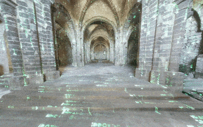

Real time Matrix VFX implemeted in Shaders in Unity using Triplanar mapping
=================

For the detailed break down of the technique, have a look at my blog post: https://medium.com/@shahriyarshahrabi/shader-studies-matrix-effect-3d2ead3a84c5

---

The Mesh is from Global Digital Heritage and is licnesed under non commercial use. https://skfb.ly/6UoNJ 

---
## Documentaion 
This was made and tested on Unity **2018.2.14f1** on **Windows** using **D3D**. It might work on other platforms fine, or might be minor issues. If there are issues, let me know. 

For downloading the project, the meshes are on **Git LFS**. Which has a very limted bandwidth, it can be that you wont be able to clone this fork, if my bandwidth quota has already been reached for this month (other people cloned and used it up), in that case just download the project as ZIP, since I wont be adding new stuff to this repo except bug fixes in the future. 

Once you open the project, you can either open the Triplanar Scene or the ScreenSpace scene (under Assets/Scene).
The screen space showcases the matrix effect on a 2D surfaces whereas the TriplanarScene shows the effect on a 3D scene. 

On both your control center is the Managment/Manager Gameobject. There you can decide if you want to have the matrix effect colored, or generally check how the effect is dispatched. To see the effect press play. 

In the Triplanar Scene, you start with no matrix effect, if you press R, the effect will be overlayed on the mesh. Press R again and the classic matrix effect will be shown. You can press R again to go to the pervious states.

Navigation in Game view is done exactly as Scene View. Right mouse click and then fly around with WASD. Press shift to get a boost in speed. 

If you are having performance issues, turn off the post process effects. 
